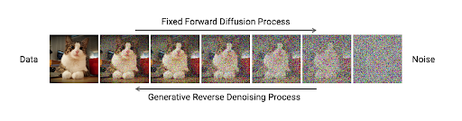
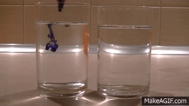
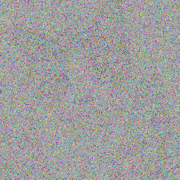

# Diffusion Model

### Input: A collection of Images

That will be our Training Data

### Output: even more Images

This is a neural network that generate multiple images for us.

# How to make images useful to a Neural Network ?? 🤔

### We want a neural network to learn what sprite is:

_Sprint: Repeating loop of images that can move independently on a display often on top of a static background_

1. Fine Details: Color of object, size of object in image
2. General Outline
3. And everything in between

**One way to learn sprite is to add different noise levels to the training data of sprites**

|| Kitty --> Probably-Kitty --> No-Idea ||

_noising process, inspired by diffusion in physics_

---

### What neural network should be thinking at each level ? 🤔

T0: It is kitty --> Keep the kitty as it is

..

T5: It is likely to be kitty --> Suggest the possible details to be fill in

..

T20: It's just an outline of Sprite --> Suggest general details for likely sprites

..

Tn: It looks nothing --> Suggest the outline of sprite

---

## Training a Neural Network to make sprites

The NN learns to take different noisy images and turn them back into sprites. It learn to remove the noise we added.

**Starts from:** No Idea --> A Cat? --> is that kitty? ---> Thats our kitty 😽

1. _No idea level_ of noise is really important because it is **normally distributed**
   > Each of those pixels is sampled from normal distribution also known as a "Gaussian Distribution" or a "bell-shaped curve".

So, when we ask neural network for a new sprite:

- We can sample noise from normal distribution
- Get a completely new sprite by using the NN to remove the the noise

Now we can get even more sprites, beyond our training data

---

## Normal Distribution

The **Normal Distribution**, also known as the **Gaussian Distribution**, is a probability distribution that is symmetric about the mean, showing that data near the mean are more frequent in occurrence than data far from the mean. The shape of the normal distribution is famously known as the "bell curve" because of its bell-shaped appearance.

### Formula

The probability density function (PDF) of the normal distribution is given by the formula:

$$ f(x | \mu, \sigma) = \frac{1}{\sigma \sqrt{2\pi}} e^{-\frac{(x - \mu)^2}{2\sigma^2}} $$

Where:

- $x$ is the variable
- $\mu$ is the mean or expectation of the distribution (and also its median and mode)
- $\sigma$ is the standard deviation
- $\sigma^2$ is the variance

This formula represents how the values of $x$ are distributed around the mean $\mu$, with a spread determined by the standard deviation $\sigma$, and it describes the normal variability in any set of data that follows this distribution.

---

## Pixel-Level Effects of Adding Noise to Images

When noise is added to an image at the pixel level, it alters the intensity values of individual pixels by introducing randomness or variations from their original values. Below we explore how Gaussian noise, a common type of noise characterized by its bell-shaped probability distribution, affects pixel values:

### Types of Noise

There are several types of noise, with **Gaussian noise** being one of the most common:

- **Gaussian Noise**: This noise is distributed in a way that most of the noise values are close to the mean (typically zero), with fewer values appearing as you move away from the mean.

### Pixel-Level Effect of Gaussian Noise

Here’s what happens at the pixel level when Gaussian noise is added:

1. **Original Pixel Value**: Consider a pixel with an original intensity value \(I\) (ranging between 0 and 255 for an 8-bit image).
2. **Noise Value**: A noise value \(N\) is generated from a Gaussian distribution with a mean of 0 and a standard deviation \($\sigma$). This value can be positive or negative, indicating an increase or decrease in the pixel's intensity.
3. **Noisy Pixel Value**: The final value of the pixel after adding noise is \(I' = I + N\). This operation is performed independently for each pixel in the image.

### Consequences of Adding Noise

- **Clipping**: After adding noise, the new pixel value \(I'\) might exceed the typical range of pixel values (0-255 for 8-bit images). If \(I'\) is greater than 255, it must be clipped to 255, and if it is less than 0, it must be clipped to 0 to ensure that the pixel values remain valid.
- **Visibility of Noise**: The amount of noise (\(N\)) added to each pixel is random but follows the distribution's shape—most changes are small (close to zero), and large deviations are less common. However, when \($\sigma$) is large, the probability of larger deviations increases, making the noise more visible.
- **Impact on Image Quality**: Noise can degrade the quality of an image, making it look grainy or speckled. This can obscure details and reduce the clarity of the image, especially in areas of uniform color or in darker regions where added noise is more noticeable.

### Illustrative Example:

Assume a pixel in a gray-scale image has a value of 120. If Gaussian noise with \($\sigma$ = 20\) is added, and a particular noise instance generates a value of +20, the new pixel value would be 140. If another instance generated a value of -50, the new pixel value would be 70 after adding noise. Both are within the valid range, so no clipping is necessary in these cases.

In summary, the addition of noise introduces a level of uncertainty and variation in each pixel’s intensity, simulating the effect of random disturbances that might occur during the image acquisition process, such as electronic interference in digital cameras or signal transmission errors.
